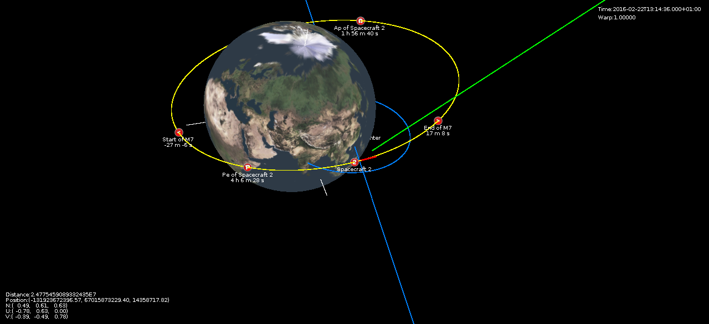

Space Simulator
===============
The Space Simulator is OPENGL application written in Java. It simulates the motion (and rotation) of the planets
and spacecraft(s).

The planets are moving based on Keplerian law (simplified elliptical) trajectory.

The position and velocity of spacecraft(s) are computed based on Newtonian gravitational law. The gravitation of all the planets
influences the trajectory of the spacecrafts.

News
====
The web application used (based on THREE.JS) is currently under construction. The link 
for the application will be revelead soon.

How to run the application?
===========================
1. The application is using maven to build, so download and install it.
2. Type the following command compiles the application, runs few tests and execute the main application.
```
	mvn clean test exec:java
```

If you do not want to execute the tests, run the following command:
```
	mvn clean compile exec:java
```

Features
========

* All 8 planets and their moons, Pluto with moons, Ceres, Vesta and Halley Comet are included in model
* Orbital maneuvers with the fuel consumption
* Sphere of Influences
* Display, exit of sphere of influence, the closest point and the planes intersections of the spacecraft and target celestial body
* Time warp
* Display popup dialogs with detail information about all objects
* User defined points for on the spacecraft and planets trajectory
* Create and remove the spacecraft
* Take a screenshot
* Create, edit and remove maneuvers.
* Collision of the spacecraft with the celestial bodies + persistent crash site point.
* Headless computations
* Load and save models
* Run the simulation from the prepared models.
* Interplanetary flight planner

Screenshots
===========





Build Status
============
	
[](https://app.wercker.com/project/bykey/262d561454952437fddc94f925ffc667)
[](https://codeship.com/projects/54024)


